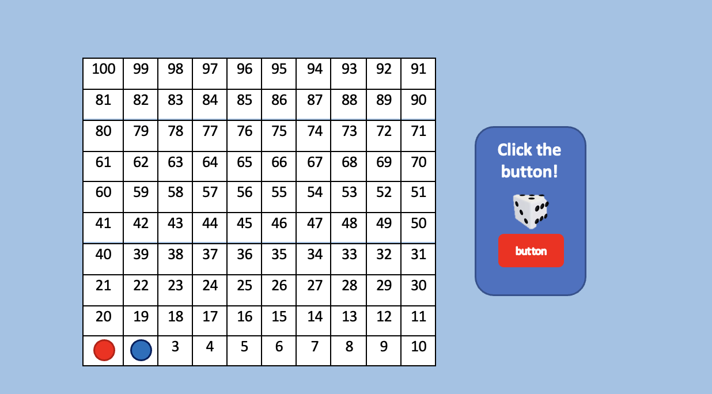

# Snakes ladders  game

- Created by: Abdulaziz Khaled
- Date: 30 jun 2025
*** 
## Description of the game:

Snakes and Ladders is one of the most famous games that is big fun; it is a perfect game to play with family and friends. Although, with this website game, you can play it anywhere without any issue; you just should have a laptop or any electronic device. Also, you should make sure that you have good “Wi-Fi ”to open the website without any problems. It is a fun and exciting game with some obstacles and some small positives that may lead you to victory with little effort, and it certainly depends on luck because your only weapon will be the dice that you throw.

## wireframes 

***
### pseudo code

1. JavaScript:
- JavaScriptis used to make a variable that may be related to the name of the changes. For example (start, turn, win, lose...)
- Functions are an important thing to do to make the changes; we may use variables inside them.

2. HTML:
- HTML, the language of the tags, with it I can create a whole body, which is considered with (divs, texts, lists, ...).
- Head is also a main tag we can use inside it (styles, links, connection with JavaScript and CSS, ...).

3. CSS:
- CSS is the language of styles; from it we can create designs, dimensions, margins, colors, etc.
- Button options are available also inside the CSS.
# Snakes-ladders-game-
