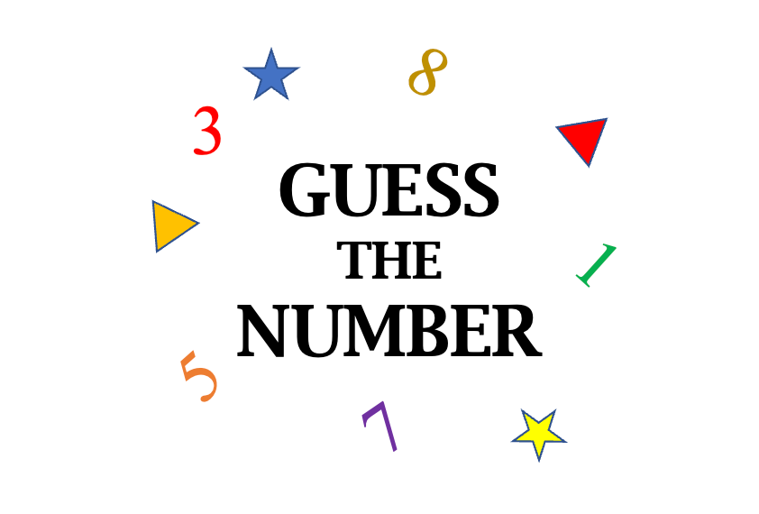

# Guess the number game

- Created by: Abdulaziz Khaled
- Date: 30 jun 2025
*** 
## Description of the game:

The number guessing game is an entertaining game that mostly relies on luck, where the player guesses a number between 1 and 50, and they have 5 attempts. The comments that appear below the writing field will also help them guess the numbers more easily. The game was created using 3 programming languages: HTML, JavaScript, and CSS. So let's get to know more about the game's contents.

## Game contents:
- Game question: The main center of the game, which contains the main reason for creating the game, which is "guess a number between 1 and 50."
- guess box: This is the box that allows the player or user to enter the number he expects between 1 and 50.
- Submission bar: The box responsible for pressing when the number is entered in the guess box to send the number to verify the answer.
- Restart bar: When you press it, the game is restarted again when the round is completed, either by winning or losing.

## wireframes 

### pseudo code

1. JavaScript:

2. HTML:
…..
3. CSS:
…..